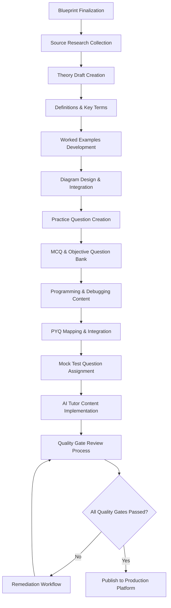

# TARGET95_CONTENT_PRODUCTION_PLAYBOOK.md
## Official Production Handbook for All Academic Content Creation
**Chief Academic Product Manager**  
**Last Updated:** August 7, 2026  
**Purpose:** End-to-end framework to take Target95 from current state to production-ready learning platform

---

## EXECUTIVE SUMMARY
This playbook establishes the standardized production system to build out Target95's complete academic content library. Starting from the current 7.6% curriculum implementation level, this 12-month roadmap delivers 100% of required content across CISCE (ICSE/ISC) and CBSE boards, with structured phases, automated workflows, clear team responsibilities, and rigorous quality gates to ensure academic excellence.

---

## 1. MASTER DEVELOPMENT PHASES
### PHASE 1: FOUNDATION
- **Purpose:** Establish chapter infrastructure, metadata framework, and curriculum mapping before content creation begins
- **Deliverables:**
  - Chapter blueprint implementation for all 158 platform chapters
  - Curriculum metadata schema alignment across all boards
  - Source research repository setup with CISCE/CBSE official syllabi
  - Content management system (CMS) configuration for chapter tracking
  - Board-specific marking scheme documentation
- **Dependencies:** TARGET95_MASTER_CURRICULUM.md and BOOLEAN_ALGEBRA_MASTER_BLUEPRINT.md finalized
- **Estimated Effort:** 8 person-weeks | 2 FTEs
- **Completion Criteria:** All chapters have skeleton structure, unique IDs, and prerequisite mapping; CMS configured to track production status

---

### PHASE 2: THEORY CONTENT CREATION
- **Purpose:** Develop all core theoretical content following the mandated pedagogical sequence
- **Deliverables:**
  - Theory sections for all chapters
  - Prerequisite and learning objectives implementations
  - Introduction and theory notes for every chapter
  - Formula/laws sections for math/science chapters
  - Revision notes and important points compilation
- **Dependencies:** Phase 1 (Foundation) 100% complete
- **Estimated Effort:** 24 person-weeks | 4 FTEs
- **Completion Criteria:** All chapters have complete theory content; no empty theory sections across the platform

---

### PHASE 3: DEFINITIONS, KEY TERMS, AND EXAMPLES
- **Purpose:** Add formal academic definitions and worked examples to reinforce theoretical concepts
- **Deliverables:**
  - Formal definitions for all core chapter concepts
  - Alphabetical key terms glossary for every chapter
  - Basic/intermediate/advanced worked examples
  - Common mistakes and exam tips implementation
  - Formula application examples
- **Dependencies:** Phase 2 (Theory) 100% complete for all chapters in the production batch
- **Estimated Effort:** 16 person-weeks | 4 FTEs
- **Completion Criteria:** Every chapter has ≥15 formal definitions and ≥20 worked examples; common mistakes section covers 10+ frequent student errors

---

### PHASE 4: VISUAL DIAGRAMS AND PRACTICE QUESTIONS
- **Purpose:** Create multimodal learning assets and formative assessment content
- **Deliverables:**
  - All required diagrams per chapter specification
  - Diagram accessibility implementation (alt text, vector format)
  - 25+ practice questions per chapter (short/long answer)
  - Practice question answer key and explanation creation
  - Diagram placement alignment with theory content
- **Dependencies:** Phase 3 (Definitions/Examples) 100% complete
- **Estimated Effort:** 20 person-weeks | 5 FTEs (3 content + 2 design)
- **Completion Criteria:** 100% of required diagrams implemented; all practice questions have model answers and explanations

---

### PHASE 5: MCQS AND OBJECTIVE ASSESSMENTS
- **Purpose:** Build section-A style objective question banks for all chapters
- **Deliverables:**
  - 30 MCQs per chapter with 4-option structure
  - Assertion & Reason questions (4 per chapter)
  - True/False questions (5 per chapter)
  - Fill-in-the-blanks questions (5 per chapter)
  - Answer key and explanation implementation for all objective questions
- **Dependencies:** Phase 4 (Practice Questions) 100% complete
- **Estimated Effort:** 12 person-weeks | 3 FTEs
- **Completion Criteria:** All objective question types implemented; difficulty distribution meets CISCE/CBSE blueprint requirements

---

### PHASE 6: PROGRAMMING AND TECHNICAL ASSESSMENTS
- **Purpose:** Create practical programming content for computer science chapters
- **Deliverables:**
  - 5+ programming questions per relevant chapter
  - Debugging questions (2 per chapter)
  - Output prediction questions (5 per chapter)
  - Java/Python code solutions with comments
  - Error explanation and debugging guidance
- **Dependencies:** Phase 5 (MCQs) 100% complete; programming environment validated
- **Estimated Effort:** 14 person-weeks | 4 FTEs (2 content + 2 dev)
- **Completion Criteria:** All code solutions compile/run without errors; programming weightage meets 30% board requirement

---

### PHASE 7: PREVIOUS YEAR QUESTIONS INTEGRATION
- **Purpose:** Integrate past board exam questions to prepare students for actual exam pattern
- **Deliverables:**
  - 15+ PYQs per chapter (2018-2025 for ISC, 2020-2025 for CBSE)
  - PYQ tagging by year, marks, and difficulty
  - Marking scheme alignment with official board guidelines
  - PYQ explanation and exam tip integration
  - Historical question trend analysis implementation
- **Dependencies:** Phase 6 (Programming) 100% complete; board question archives sourced
- **Estimated Effort:** 10 person-weeks | 3 FTEs
- **Completion Criteria:** All chapters have PYQs mapped to their topics; 100% of PYQs include official marking scheme references

---

### PHASE 8: MOCK TEST DEVELOPMENT
- **Purpose:** Build full-length mock assessments aligned with board exam patterns
- **Deliverables:**
  - 3 full-length mock tests per board/class
  - Chapter-wise question weightage matching board blueprint
  - Mock test answer key and marking scheme
  - Time allocation and exam instruction implementation
  - Performance analytics framework setup
- **Dependencies:** Phase 7 (PYQs) 100% complete for all chapters in the class
- **Estimated Effort:** 8 person-weeks | 3 FTEs
- **Completion Criteria:** Mock tests generate accurate scores; question distribution matches official board paper pattern

---

### PHASE 9: AI TUTOR INTEGRATION
- **Purpose:** Implement adaptive learning and doubt resolution capabilities
- **Deliverables:**
  - Frequently asked doubt datasets for all chapters
  - Common misconception tagging for all high-frequency errors
  - Hint strategy implementation (3-tiered hint system)
  - Explanation strategy for different student proficiency levels
  - Spaced repetition content integration
- **Dependencies:** Phase 8 (Mock Tests) 100% complete; AI tutor platform configured
- **Estimated Effort:** 12 person-weeks | 4 FTEs (2 content + 2 AI/ML)
- **Completion Criteria:** AI tutor can resolve 90% of student FAQs; adaptive hint system triggers correctly for common mistakes

---

## 2. CHAPTER PRODUCTION WORKFLOW
### Standardized End-to-End Process for Every Chapter

### Mandatory Workflow Checks
- No parallel development of out-of-sequence phases for any chapter
- All dependencies must be signed off before starting the next phase
- Quality gates cannot be skipped for any chapter, even if content is reused
- CMS status must be updated after each phase completion for tracking

---

## 3. TEAM RESPONSIBILITIES
### AI Tool Roles and Responsibilities
| Tool | Core Responsibilities | Workflow Stage |
|------|------------------------|----------------|
| **ChatGPT (GPT-4o)** | Draft theory content, generate basic question frameworks, create first-pass explanations | Theory creation, examples development, practice question drafting |
| **NotebookLM** | Process official CISCE/CBSE syllabi, extract board requirements, synthesize source research, create citation-validated content | Source research, blueprint compliance verification, PYQ mapping |
| **Claude 3.5 Sonnet** | Write complex programming solutions, debug code, create detailed step-by-step explanations, generate long-form academic content | Programming phase, output question creation, AI tutor explanation strategy |
| **Cline** | Code quality review, validate program execution, identify logical errors in code solutions, ensure Java/Python best practices | Programming accuracy quality gate, code solution validation |
| **Codex** | Auto-generate code templates, standardize programming question structure, ensure consistent code commenting across all solutions | Programming phase, code template standardization |
| **Trae** | End-to-end project management, cross-phase dependency tracking, quality gate coordination, production milestone reporting | All phases - platform orchestration and governance |

### Human Team Roles and Responsibilities
| Role | Core Responsibilities | Workflow Stage |
|------|------------------------|----------------|
| **Academic Reviewer (Subject Matter Expert)** | Validate theoretical accuracy, check board alignment, approve content for publication | Academic review quality gate, final content sign-off |
| **Board Compliance Specialist** | Verify alignment with CISCE/CBSE blueprints, confirm marking scheme accuracy, validate PYQ mapping | Board compliance quality gate |
| **Grammar/Editorial Specialist** | Proofread all content, ensure consistent terminology, fix spelling/grammar errors, maintain style guide compliance | Grammar quality gate |
| **Diagram Designer/Reviewer** | Validate diagram accuracy, ensure accessibility standards, check visual alignment with theory content | Diagram review quality gate |
| **Question Quality Auditor** | Verify question difficulty distribution, check for duplicates, ensure Bloom's taxonomy alignment, validate assessment balance | Question quality quality gate |
| **Mobile UX Reviewer** | Test content rendering on mobile devices, ensure responsive design, validate interactive elements work across screen sizes | Mobile review quality gate |

---

## 4. QUALITY GATES - MANDATORY FOR ALL CHAPTERS
No chapter can be published unless it passes ALL quality gates:

### GATE 1: ACADEMIC REVIEW
- ✅ All theoretical content is factually accurate
- ✅ No conceptual errors in any section
- ✅ Prerequisites and learning objectives are correctly mapped
- ✅ Content aligns with the master blueprint structure
- ✅ Signed off by SME academic reviewer

### GATE 2: BOARD COMPLIANCE
- ✅ Chapter content matches official CISCE/CBSE syllabus
- ✅ Question weightage meets board blueprint requirements
- ✅ Marks allocation aligns with official marking scheme
- ✅ PYQs are correctly classified by year and marks
- ✅ Mock test distribution matches board exam pattern

### GATE 3: GRAMMAR AND LANGUAGE
- ✅ Zero spelling or grammatical errors
- ✅ Consistent terminology across all chapters
- ✅ Adherence to Target95 style guide
- ✅ Clear, accessible language for target class level
- ✅ No ambiguous phrasing in any question or explanation

### GATE 4: PROGRAMMING ACCURACY
- ✅ All code solutions compile and execute without errors
- ✅ Code follows Java/Python best practices
- ✅ Debugging questions have correct error identification
- ✅ Output prediction questions have accurate answers
- ✅ All programming questions have complete model solutions

### GATE 5: DIAGRAM REVIEW
- ✅ All required diagrams are implemented
- ✅ Diagrams are vector format and accessible
- ✅ All diagrams have descriptive alt text
- ✅ Diagram placement aligns with relevant theory content
- ✅ Diagrams are factually accurate and educationally effective

### GATE 6: QUESTION QUALITY
- ✅ No duplicate questions across chapters
- ✅ Difficulty distribution meets 40%/40%/20% blueprint
- ✅ Bloom's taxonomy tags correctly assigned to all questions
- ✅ No repeated concepts across question sets
- ✅ All questions have clear, unambiguous correct answers

### GATE 7: MOBILE REVIEW
- ✅ All content renders correctly on mobile devices
- ✅ Interactive elements work across screen sizes
- ✅ Code blocks are readable on mobile
- ✅ Diagrams scale properly without losing clarity
- ✅ Assessment interfaces work on touch devices

---

## 5. PRODUCTION MILESTONES
### MILESTONE 1: 25% COMPLETION (MONTH 4)
- **Required Deliverables:**
  - 100% of ISC Class 11 chapters complete through Phase 3 (Definitions/Examples)
  - 50% of ISC Class 11 chapters complete through Phase 6 (Programming)
  - CMS fully operational with all chapters tracked
  - All AI tool workflows validated and standardized
  - First 4 ISC Class 11 chapters pass all quality gates and published
  - Quality gate process fully documented and team-trained

### MILESTONE 2: 50% COMPLETION (MONTH 8)
- **Required Deliverables:**
  - 100% of ISC Class 11 and 12 chapters complete through Phase 7 (PYQs)
  - 100% of CBSE Class 10 chapters complete through Phase 4 (Practice Questions)
  - First full-length ISC Class 11 mock test published
  - AI tutor integration complete for all ISC Class 11 chapters
  - 50% of all platform chapters have passed all quality gates
  - Production process optimized based on first 4 months of learnings

### MILESTONE 3: 75% COMPLETION (MONTH 10)
- **Required Deliverables:**
  - 100% of CISCE (ICSE/ISC) content complete through all 9 phases
  - 100% of CBSE Class 10 and 11 chapters complete through Phase 7 (PYQs)
  - All 3 ISC mock tests and 3 CBSE Class 10 mock tests published
  - AI tutor integration complete for all CISCE chapters
  - 75% of all platform chapters published to production
  - Final quality gate process refinements implemented

### MILESTONE 4: 100% COMPLETION (MONTH 12)
- **Required Deliverables:**
  - All 158 platform chapters complete through all 9 phases
  - All mock tests for all boards/classes published
  - AI tutor integration complete for every chapter
  - 100% of chapters pass all quality gates and published to production
  - Final platform audit completed with zero critical gaps
  - Target95 declared production-ready for full student launch

---

## APPENDIX: BUDGET AND RESOURCE ALLOCATION
### Total Estimated Resources
- Total person-weeks: 140 (phases 1-9)
- Average FTE requirement: 4.5 throughout production
- AI tool licensing: Covered under existing platform agreements
- Human SME requirement: 2 full-time academic reviewers
- Timeline adherence dependency: No scope changes to master curriculum after production start

### RISK MITIGATION
| Risk | Likelihood | Impact | Mitigation Strategy |
|------|------------|--------|---------------------|
| Board syllabus updates | Medium | High | Schedule quarterly syllabus review cycles; build 2-week buffer for updates |
| AI tool limitations | Medium | Medium | Maintain human-in-the-loop review; create content templates to reduce AI dependency |
| Resource bottlenecks | Medium | High | Cross-train team members; prioritize critical path chapters; maintain phase buffer |
| Quality gate failures | High | Medium | Implement pre-review checks; track common failure causes; provide team training |
| Timeline delays | Medium | High | Weekly production status meetings; CMS-driven milestone tracking; early identification of bottlenecks |